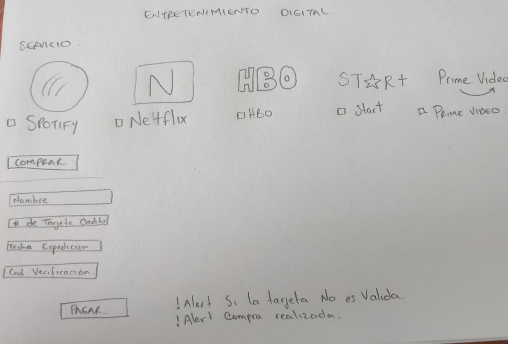

# CARD VALIDATION
## Entretenimiento Digital
El proyecto consta de una app web en la cual se ofertan servicios de Entretenimiento Digital como: Netflix, Spotify, Star+, Disney+, entre otros, donde al realizar el pago se valida el # de tarjeta con la cual se realizara la compra del servicio.

## ¿Quienes son los usuarios?

Los ususarios son todxs lxs personas mayores de edad que deseen adquirir los servios de entretenimiento digital de paginas o aplicaciones como Netflix, Star+, Disney+, Spotify, HBO, entre otras. Lxs cuales buscan tener alternativas de ocio mediante el uso de dispositivos moviles.

## Solución del problema/necesidad

Tras la pandemia el uso masivo de la digitalización aumento, en especial el de los dispositivos moviles, lxs personas aumentaron su consumo de productos y servicios digitales, donde buscan encontrar pasatiempos, las aplicaciones de contenidos audiovisual ofrecen diversas opciones para la diversión personal, desde ver series, peliculas, documentales o videos y escuchar musica o podcast.

### Primer Prototipo

### Feedback

Al realizar feedback de la primera idea, se generaron ´preguntas como si lxs personas si utilizan estos servicios seguidos o si recurren al pago de estos con medios electronicos, en este caso las tarjetas de credito, para lo cual informe que si se usan muy seguido ya que estois servicios estan en auge y son inovados constantemente, ademas en la actualidad el pago con medios electronicos es mucho mas usado.

tras ver que si era posible mi idea principal era la venta de estos servicios de forma individual pero mi dupla o compañera me dijo que no es tan llamativo que quiza buscara poner un carrito de compras o buscar otra idea mas llamativa a lo cual le comente que lo pensaba manejar ofertando combos de servicios y seria asi mas atratctivo, por lo cual ella le gusto la idea.

### Prototipo Final

